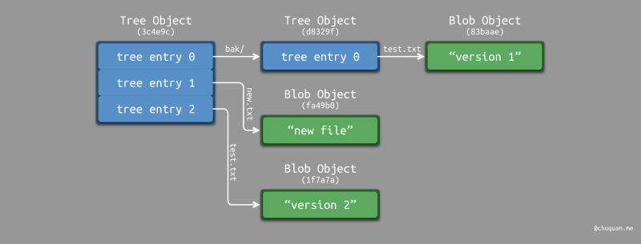
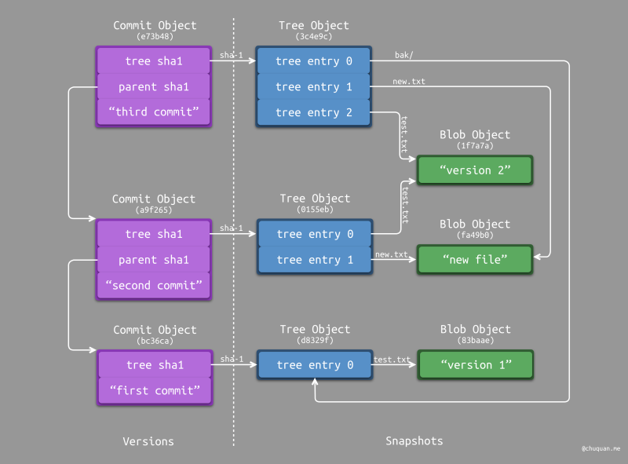

# GitStudy

这里记录我平时对git的实践和底层原理的学习笔记

参考链接：

https://www.jiyik.com/w/git/git-merge

http://chuquan.me/2022/05/21/understand-principle-of-git/

https://developer.aliyun.com/article/716483#slide-17


## git原理与相关概念


#### 区域和状态

##### 区域

+ 工作目录

+ 暂存区

+ 本地仓库

+ 远程仓库

##### 文件状态

+ 未跟踪

+ 已修改（工作目录）

+ 已暂存（暂存区）

+ 已提交（本地仓库）

+ 未修改（工作目录）


#### git对象

所有对象均存储在`.git/objects`目录下

采用两部分的未压缩内容的 40 位 SHA-1 值（前 2 为作为子目录，后 38 位作为文件名）作为快照文件的唯一标识

文件内容为两部分：

    + 头部信息：类型 + 空格 + 内容字节数 + \0 

    + 存储内容

##### 二进制对象（Blob Object）

存储普通文件的内容数据

##### 树对象（Tree Object）

存储目录文件的内容数据，存储类型为一个或多个树对象记录（Tree Entry）

树对象记录的结构（Git v2.0.0）为：文件模式 + 空格 + 树对象记录的字节数 + 文件路径 + \0 + SHA-1

```
$ tree
.
├── bak
│   └── test.txt
├── new.txt
└── test.txt
```


我们执行 git add（进入暂存区）时，Git 会为暂存文件创建 Blob Object，为暂存目录创建 Tree Object ，结合未修改文件和目录的 Object，建立一个整体的索引关系，从而形成一个版本快照。

##### 提交对象（Commit Object）

存储的内容为：

+ 对应的根 Tree Object 对应的 SHA-1

+ 一个或多个父级 Commit Object 对应的 SHA-1。当进行分支合并时就会出现多个父级 Commit Object。

+ 提交相关内容，包括：作者信息、提交者信息、编码、提交描述等

Tree Object 和 Blob Object 用于表示版本快照，Commit Object 则不同，它 用于表示版本索引和版本关系。

Tree Object 和 Blob Object 的 SHA-1 值是根据内容计算得到的，只要内容相同，SHA-1 值相同；而 Commit Object 会结合内容、时间、作者等数据，因此 SHA-1 值很难出现冲突。


##### 三者间关系



##### Tag Object标签对象

存储内容为

+ 所引用对象的 SHA-1 值

+ 所引用对象的类型

+ 标签名称

+ 标签创建者和日期

+ 注释信息

通常指向一个commit对象，并且永远不变


#### 引用

Git 使用一个带有名字的指针对象来指向对应的 SHA 值，这个指针被称为“引用”，这些引用指针都存放在`.git/refs`下。

##### 分支引用

分支指针指向一个commit对象

##### HEAD引用

HEAD 位于 .git/HEAD，这是一个符号引用，指向目前所在的分支。如果 HEAD 文件内容为 Git 对象的 SHA 值，那么就会处于 “头指针分离” 状态

#### 标签引用

就是上面的标签

##### 远程引用

远程引用（Remote Reference）主要用于远程仓库与本地仓库进行映射和对比。如果我们添加了一个远程仓库并对其执行过推送操作，Git 会记录下最近一次推送操作时每一个分支所对应的值，并保存在`.git/refs/remotes/`目录下。

远程引用是只读的。虽然我们可以 git checkout 到某个远程引用，但是 Git 并不会将 HEAD 引用指向该远程引用。因此，我们永远不能通过 git commit 命令来更新远程引用。Git 将这些远程引用作为记录远程服务器上各个分支最后已知位置状态的书签来管理。

如果查看 refs/remotes/origin/master 文件，可以发现 origin 远程版本库的 master 分支所对应的 SHA-1 值，就是最近一次与服务器通信时本地 master 分支所对应的 SHA-1 值


## .git目录

```
.git
├── COMMIT_EDITMSG  
├── FETCH_HEAD 
├── HEAD 
├── ORIG_HEAD 
├── config
├── description
├── hooks
├── index
├── info
├── logs
├── objects
└── refs
```

#### COMMIT_EDITMSG

此文件是一个临时文件，存储最后一次提交的信息内容

#### FETCH_HEAD

追踪远程分支的拉取与合并，与其相关的命令有 git pull/fetch/merge，存储fetch下来的HEAD

git pull相当于：git fetch + git merge FETCH_HEAD

#### HEAD

永远存储当前位置指针，存储分支名或者哈希值（分离）

#### ORIG_HEAD

在你进行危险操作时备份 HEAD ：reset merge rebase pull

#### config

存储项目本地的 git 设置

git config往里面追加内容，git config --global 影响的则是全局配置文件 ~/.gitconfig

#### description

主要用于 GitWeb 的描述

#### hooks

用于在 git 命令前后做检查或做些自定义动作

```
├── hooks
    ├── applypatch-msg.sample # 用于 git am 命令提交信息校验
    ├── commit-msg.sample # git commit 之前，编辑器退出后触发，传入 COMMIT_EDITMSG 文件名
    ├── fsmonitor-watchman.sample # 配合 core.fsmonitor 设置来更好监测文件变化
    ├── post-update.sample # git push 之后，服务端更新 ref 后触发
    ├── pre-applypatch.sample # 用于 git am 命令执行前动作
    ├── pre-commit.sample # git commit 之前，commit-msg 通过后触发，譬如校验文件名是否含中文
    ├── pre-merge-commit.sample # git-merge调用，在合并操作执行成功，获得提交消息之前执行该钩子
    ├── pre-push.sample # git push 之前触发
    ├── pre-rebase.sample # git rebase 之前触发，传入 rebase 分支作参数
    ├── pre-receive.sample # git push 之后，服务端更新 ref 前触发
    ├── prepare-commit-msg.sample # git commit 之前，编辑器启动之前触发，传入 COMMIT_FILE，COMMIT_SOURCE，SHA1
    ├── push-to-checkout.sample 
    └── update.sample # git push 之后，服务端更新每一个 ref 时触发，用于针对每个 ref 作校验等
```

#### index

简要说一下，index 是一个微型的 linux文件系统，用最经济的方式实现了 inode，这并不是偶然，因为创造这个想法的人同时也是 linux 的创造者 Linus Torvalds。

这个文件也叫做 git 的暂存区(Staging Area)，git add 就是把工作区内的某些文件取部分 stat 抓取的内容并写入 .git/index 文件并存为相应的一条 index entry，多条 index entry 形成一个 tree。

git commit 是把上一步形成的 tree 结构及相应的 blob 存储到 objects/ 文件夹下并同时生成一条 commit 记录。

git reset 是将刚写入 index 文件的 tree 丢弃，并从 HEAD 中恢复一个 tree。

git status 是拿 index 文件中存储的 tree 与工作区内的文件在 stat 层面做对比，并输出变更。

#### info

文件 info/exclude 用于排除规则，与 .gitignore 功能类似

可能会包含文件 info/refs ，用于跟踪各分支的信息

#### logs

```
├── logs
    ├── HEAD
    └── refs
        ├── heads
        │   └── main
        └── remotes
            └── origin
                ├── HEAD
                └── main
```
记录了操作信息，git reflog 命令以及像 HEAD@{1} 形式的路径会用到

#### objects

```
├── objects
    ├── 02
    │   └── 0db89ffa220224b8f59279a9600c59341e424e
    |.....
    ├── info
    └── pack
        ├── pack-b812e0455316747fc0bb9f6976369675d0dd4907.idx
        └── pack-b812e0455316747fc0bb9f6976369675d0dd4907.pack
```

存储git对象，上面讲过

对于pack：存储git打包objects后的pack

#### refs

```
── refs
    ├── heads
    │   ├── dev1
    │   └── main
    ├── remotes
    │   └── origin
    │       ├── HEAD
    │       └── main
    └── tags
```

refs/heads/ 文件夹内的 ref 一般通过 git branch 生成。git show-ref --heads 可以查看。

refs/tags/ 文件夹内的 ref 一般通过 git tag 生成。git show-ref --tags 可以查看。

内容存储的都是对应object的哈希值


## git 命令


### 开始

#### git clone 

git clone主要用于指向现有的仓库，并在另一个新目录中创建该仓库的克隆副本。
克隆会自动创建一个名为“origin”的远程连接，指向原始仓库。

#### git init 

git init命令会创建一个新的 Git 仓库库。它可用于将现有的、未进行版本控制的项目转换为 Git 仓库或初始化一个新的空的仓库。
会在当前工作目录中创建一个子目录.git，其中包含新仓库所需的所有 Git 元数据。此元数据包括对象、引用和模板文件等子目录。
还会创建一个HEAD文件，指向当前签出的提交。


### 工作区和暂存区

#### git add

将文件添加到暂存区

#### git restore

还原工作区

git restore --staged 文件名： 将暂存区的修改恢复到工作区（包括文件删除，新增）

git restore 文件名：丢弃工作区的修改（不包括文件删除，新增）

#### git stash

暂时隐藏我们工作区和暂存区的修改，让我们切换其他分支处理完事情后回来继续工作

git stash list

git stash pop

git stash save "此次stash的message"

git stash drop $stashid


### Show Status

#### git diff

作用是比较更改

下面是git diff的输出格式

比较输入：
diff --git a/README.md b/README.md

元数据：忽略
index ae53de2..d0d4980 100644

变化标记：
--- a/README.md
+++ b/README.md

差异块：从62行开始提取了六行，从34行开始添加了25行
@@ -62,6 +62,25 @@ 

-删除的内容
+新增的内容

#### git status

展示当前工作目录、暂存区和当前分支的状态

#### git log

查看当前分支的历史提交情况

#### git reflog

能够记录几乎所有本地仓库的改变，包括所有分支的commit提交，以及已经被删除的commit


### Commit和Branch

#### git commit 

提交文件

+ 提交附加commit信息 git commit -m "the commit message" 
+ 先把所有已经track的文件的改动`git add`进来，然后提交  git commit -a
+ 增补提交，会使用与当前提交节点相同的父节点进行一次新的提交，旧的提交将会被取消  git commit --amend 

#### git branch

分支相关操作

+ 查看本地
+ 新建本地分支
+ 查看本地和远程分支
+ 修改分支的名字
+ 删除本地分支
+ 手动建立追踪关系

#### git checkout

HEAD指针：既可以指向快照节点，也可以指向branch
当指向branch的时候，提交后会随着branch指针一起向后移动
当不指向branch的时候，提交的时候会在一个detached状态

git checkout 操控三个不同对实体 文件，提交和分支（分支属于特殊的提交）

git checkout 节点哈希值：将分离HEAD指向此commit

git checkout 分支名：将HEAD指向指定分支

git checkout 分支名/节点哈希值 文件路径名：签出文件 ，将当前工作区文件修改(省略分支名则恢复上一次commit)

#### git merge

将指定分支合并到当前分支
Fast Forward 和 三路合并
对于三路合并，会自动提交一次

#### git rebase

将指定分支rebase到当前分支
不能在协作分支上进行rebase操作！！！
当rebase完，本地分支与远程分支不一样时，可以直接push-f
git pull –rebase 会使commit看起来很自然,因为代码都有一个前后依赖，看起来更加的直观

[rebase vs merge](https://joyohub.com/2020/04/06/git-rebase/)

#### git reset

修改git三棵树

git三棵树：

+ HEAD：上一次的提交，下一次commit的父节点

+ index：暂存区，下一次被提交的内容

+ working directory：沙盒

git reset会以特定顺序修改这三棵树，若

git reset --soft $HASH #移动HEAD到指向节点

git reset --mixed $HASH #修改HEAD和index到指向节点

git reset --hard $HASH #修改三者内容，前面的commit将会成为孤儿节点，会被git 定期垃圾回收

#### git revert

git revert命令可以被认为是“撤消”命令。但是它不是传统的撤消操作。
不是从项目历史中删除提交，而是计算出如何反转要撤销的提交所引入的更改，
并附加一个新的提交及生成的反向内容。这种方式可以防止 Git 丢失历史记录

#### git cherry-pick

它允许我们通过引用选择任意 Git 提交并将其附加到当前工作分支的 HEAD

```
a - b - c - d   Main
         \
           e - f - g Feature

$ (Main) git cherry-pick f-hash

a - b - c - d - f   Main
         \
           e - f - g Feature
```


### Remote collaborate

#### git push

对远程分支进行修改操作

格式：git push 主机名 本地分支名 远程分支名

如果省略远程分支名，则表示将本地分支推送与之存在”追踪关系”的远程分支(通常两者同名)，如果该远程分支不存在，则会被新建

如果省略本地分支名而不省略远程，则等同于删除远程分支

-u 参数：选项指定一个默认主机，这样后面就可以不加任何参数使用git push

--all 参数：不管是否存在对应的远程分支，将本地的所有分支都推送到远程主机

--tags 参数：推送标签

-f 参数：强行覆盖远程分支，远程分支相关修改会被丢弃

git push 主机名 --delete 分支名：删除对应主机远程分支

#### git pull

取回远程的分支，和本地对应的分支合并，本地若不存在则新建本地分支（git fetch + git merge）

格式：git pull 主机名 远程分支名 本地分支名

git pull --rebase <remote> #使用rebase而不是merge

#### git fetch

获取远程分支，但不合并

git fetch <remote>

git fetch <remote> <branch>

#### git remote

管理远程仓库

git remote 列出所有远程仓库

git remote add <name> <url>添加远程仓库


## git修改

cherry-pick:main:12 dev1:13